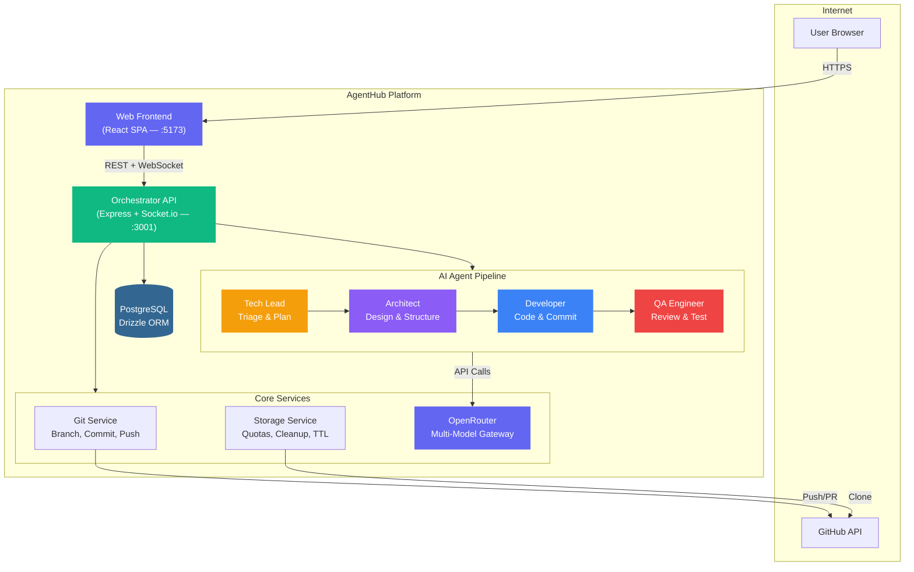
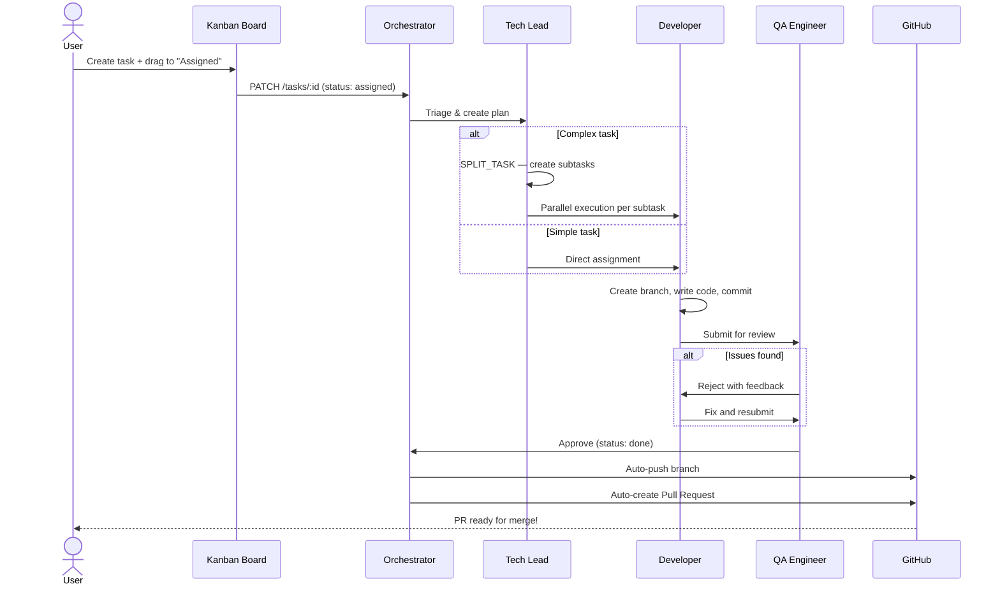

<div align="center">


# AgentHub

**Multi-Agent AI Orchestration Platform — automate software development with autonomous agents.**

[](https://typescriptlang.org)
[](https://react.dev)
[](https://nodejs.org)
[](https://postgresql.org)
[](https://openrouter.ai)
[](#license)

[Features](#-features) · [Architecture](#-architecture) · [Agent Workflow](#-agent-workflow) · [Getting Started](#-getting-started) · [Tech Stack](#-tech-stack)

</div>

---

## What is AgentHub?

AgentHub is an **AI-powered development orchestration platform** that coordinates multiple AI agents to automate software engineering tasks. Import a GitHub repository, describe what you want built, and a team of specialized agents — Tech Lead, Architect, Developer, QA — executes the work autonomously in isolated git branches, with real-time progress tracking and automatic pull request creation.

Think of it as your own **AI dev team** — always available, working in parallel, with full audit trail.

---

## Features

| Category | What you get |
|---|---|
| **Multi-Agent Workflows** | Tech Lead triages, Architect plans, Developer codes, QA reviews. Fully automatic pipeline. |
| **GitHub Integration** | Import repos, auto-branch per task, push commits, create PRs — all automated |
| **Real-time Dashboard** | Live task progress, agent status indicators, WebSocket updates |
| **Kanban Board** | Drag tasks through columns: Created, Assigned, In Progress, Review, Done |
| **Code Editor** | Monaco Editor with IntelliSense, diff viewer, git history, 50+ languages |
| **Model Catalog** | 45+ AI models from Anthropic, OpenAI, Google, DeepSeek, Mistral, Meta — categorized by skill |
| **Plan-based Quotas** | Per-plan limits: max projects, tasks/month, storage, allowed models |
| **Storage Management** | User-isolated repos, shallow clones, automatic TTL cleanup, quota enforcement |
| **Analytics** | Agent performance, cost tracking by model/agent/day, task trends |
| **Integrations** | WhatsApp (auto-reconnect), Telegram bots, Git webhooks |
| **Team Collaboration** | Teams, role-based access (owner/admin/member), invites |
| **Security** | AES-256-GCM encryption, GitHub OAuth, JWT, rate limiting, path traversal protection |
| **Admin Panel** | Manage users, plans, OpenRouter config, global metrics dashboard |
| **380+ Tests** | Unit, integration, E2E flows — all passing |

---

## Architecture



### How the pieces fit together

| Component | Role | Tech |
|---|---|---|
| **Web Frontend** | SPA with dashboard, kanban board, code editor, analytics, admin panel | React 19 + Vite + Tailwind CSS 4 |
| **Orchestrator** | REST API, WebSocket server, agent execution engine, git operations | Express + Socket.io + Node.js |
| **Database** | Projects, agents, tasks, messages, logs, plans, teams, workflows | PostgreSQL + Drizzle ORM |
| **OpenRouter** | Multi-model AI gateway — 45+ models from 6 providers | OpenAI SDK compatible |
| **Git Service** | Branch management, commits, push/pull, PR creation via `gh` CLI | `execFile` (injection-safe) |
| **Storage Service** | User-isolated repos, shallow clones, quota enforcement, TTL cleanup | Node.js + cron scheduler |

---

## Agent Workflow



### Task State Machine

```
created → assigned → in_progress → review → done
                                    review → assigned (reject with feedback)
                                    * → failed (error)
```

---

## Model Catalog

AgentHub includes a curated catalog of **45+ AI models** organized by skill:

| Category | Best For | Example Models |
|---|---|---|
| **Coding** | Code generation, editing, debugging | Claude Opus 4.6, GPT-4.1, Codestral, DeepSeek V3.2 |
| **Reasoning** | Complex problem solving, math | o3, DeepSeek R1, Gemini 2.5 Pro |
| **General** | Balanced multi-task | Claude Sonnet 4.5, Mistral Large, Llama 4 Maverick |
| **Fast** | Quick responses, high throughput | Claude Haiku 4.5, Gemini 2.5 Flash, GPT-4.1 Mini |
| **Budget** | Low cost for simple tasks | Gemini 2.0 Flash, GPT-4.1 Nano, Claude 3 Haiku |

Admins configure which models each plan can access. Models display with friendly names and skill tags throughout the UI.

---

## Getting Started

### Prerequisites

| Requirement | Version |
|---|---|
| Node.js | 18+ |
| pnpm | 9+ |
| PostgreSQL | 16+ |
| Git | 2.x+ |
| GitHub OAuth App | Client ID + Secret |

### Development

```bash
# Clone
git clone https://github.com/JohnPitter/agenthub.git
cd agenthub

# Install dependencies
pnpm install

# Configure
cp apps/orchestrator/.env.example apps/orchestrator/.env
# Edit .env: set DATABASE_URL, GITHUB_CLIENT_ID, GITHUB_CLIENT_SECRET, JWT_SECRET

# Run migrations
pnpm db:migrate

# Build all packages
pnpm build

# Start development (web + orchestrator)
pnpm dev

# Access
#   Web UI:     http://localhost:5173
#   API:        http://localhost:3001
#   Health:     http://localhost:3001/api/health
```

### Production (via LuxView Cloud)

AgentHub deploys as a single-container app on [LuxView Cloud](https://github.com/JohnPitter/luxview-cloud) with auto-detected stack, managed PostgreSQL, and SSL.

```bash
# On LuxView Cloud: connect GitHub, select agenthub, deploy
# DATABASE_URL and PGHOST/PGPORT are auto-injected
```

---

## Tech Stack

<div align="center">

| Layer | Technology |
|:---:|:---:|
| **Frontend** | React 19, TypeScript, Vite, Tailwind CSS 4, Zustand, Monaco Editor, Recharts, Socket.io Client |
| **Backend** | Express, Socket.io, OpenRouter (OpenAI SDK), Node.js crypto (AES-256-GCM) |
| **Database** | PostgreSQL 16 via postgres.js + Drizzle ORM |
| **AI Models** | OpenRouter gateway — Anthropic, OpenAI, Google, DeepSeek, Mistral, Meta |
| **Auth** | GitHub OAuth + JWT (httpOnly cookies) |
| **Tooling** | pnpm 9, Turborepo, TypeScript 5.8 strict mode, Vitest |
| **Security** | AES-256-GCM encryption, execFile only, parameterized queries, rate limiting |

</div>

---

## Project Structure

```
agenthub/
  apps/
    web/                        # React SPA frontend
      src/
        routes/                 # Pages: dashboard, projects, agents, tasks, analytics, admin, settings
        components/             # UI components organized by domain
        stores/                 # Zustand state management
        hooks/                  # Custom React hooks
        i18n/                   # Internationalization (pt-BR, en-US, es, ja, zh-CN)

    orchestrator/               # Node.js API backend
      src/
        routes/                 # REST endpoints (projects, tasks, agents, git, storage, admin, plans)
        agents/                 # Agent manager — workflow execution engine
        services/               # Business logic (storage, OpenRouter, auth, GitHub)
        git/                    # Git operations (clone, commit, push, PR)
        integrations/           # WhatsApp, Telegram services
        realtime/               # Socket.io event handlers
        tasks/                  # Task lifecycle, watcher, cleanup scheduler
        middleware/             # Auth, rate limiter, error handler, security headers
        lib/                    # Utilities (logger, encryption, storage, detect-stack)

  packages/
    database/                   # Drizzle ORM schemas + migrations
      src/schema/               # 16 tables: projects, agents, tasks, messages, plans, teams, etc.
      drizzle/                  # SQL migration files

    shared/                     # Shared types & constants
      src/
        types/                  # TypeScript interfaces (Agent, Task, Project, Events, etc.)
        constants/              # Default agents, task states, model catalog, stack icons
```

---

## Environment Variables

| Variable | Description | Required |
|---|---|---|
| `DATABASE_URL` | PostgreSQL connection string | Yes |
| `JWT_SECRET` | JWT signing secret | Yes |
| `GITHUB_CLIENT_ID` | GitHub OAuth App client ID | Yes |
| `GITHUB_CLIENT_SECRET` | GitHub OAuth App client secret | Yes |
| `ENCRYPTION_KEY` | AES-256-GCM key (32 bytes hex) | Production |
| `OPENROUTER_API_KEY` | OpenRouter API key (or configure via Admin panel) | No |
| `ORCHESTRATOR_PORT` | API port (default: 3001) | No |
| `CORS_ORIGINS` | Allowed CORS origins (default: localhost:5173,5174) | No |
| `STORAGE_PATH` | Base directory for repos (default: ~/.agenthub) | No |

---

## Scripts

| Command | Description |
|---|---|
| `pnpm dev` | Start all apps (web + orchestrator) |
| `pnpm dev:web` | Start frontend only |
| `pnpm dev:orchestrator` | Start backend only |
| `pnpm build` | Build all packages |
| `pnpm db:migrate` | Run database migrations |
| `pnpm db:seed` | Seed database with default agents |

---

## Database Schema

| Table | Purpose |
|---|---|
| `projects` | GitHub repos with path, stack, owner, storage tracking |
| `agents` | AI agents with role, model, tools, permissions, soul |
| `tasks` | Dev tasks with status, priority, branch, cost, tokens |
| `messages` | Threaded chat history (user + agent messages) |
| `task_logs` | Complete audit trail for every operation |
| `plans` | Subscription plans with quotas and allowed models |
| `users` | User accounts with GitHub OAuth + encrypted tokens |
| `teams` | Team collaboration with role-based access |
| `workflows` | Custom agent pipeline definitions (nodes + edges) |
| `integrations` | Git, WhatsApp, Telegram configs + encrypted credentials |
| `notifications` | User notification queue |
| `skills` | Custom skills library assignable to agents |

---

## Security

| Protection | Implementation |
|---|---|
| **Credential Encryption** | AES-256-GCM — tokens, API keys, git credentials never stored in plain text |
| **Command Injection** | `execFile` only (never `exec`/`execSync`), args as array |
| **SQL Injection** | Drizzle ORM parameterized queries, never string interpolation |
| **Path Traversal** | `path.resolve()` + boundary validation before every file operation |
| **XSS** | React built-in escaping, content sanitized before render |
| **Auth** | GitHub OAuth + JWT (httpOnly, secure, sameSite strict, 7-day max) |
| **Rate Limiting** | All API routes protected, stricter limits on auth endpoints |
| **Storage Isolation** | Per-user repo directories, path validation before rm operations |

---

## License

CC BY-NC 4.0 — personal use allowed, commercial use prohibited. See [LICENSE](LICENSE).

---

<div align="center">

**Built with TypeScript and React by [@JohnPitter](https://github.com/JohnPitter)**

</div>
